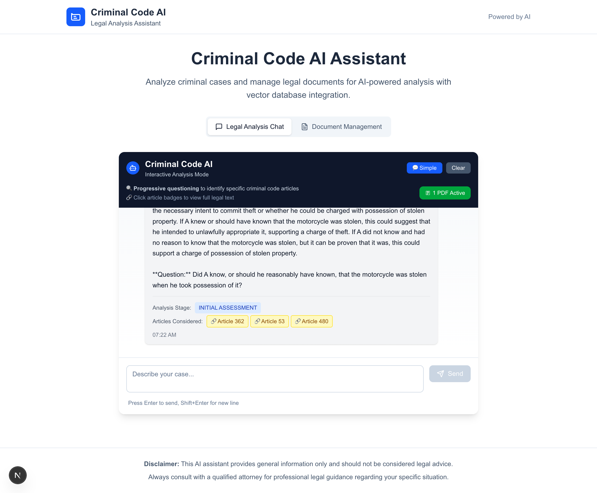
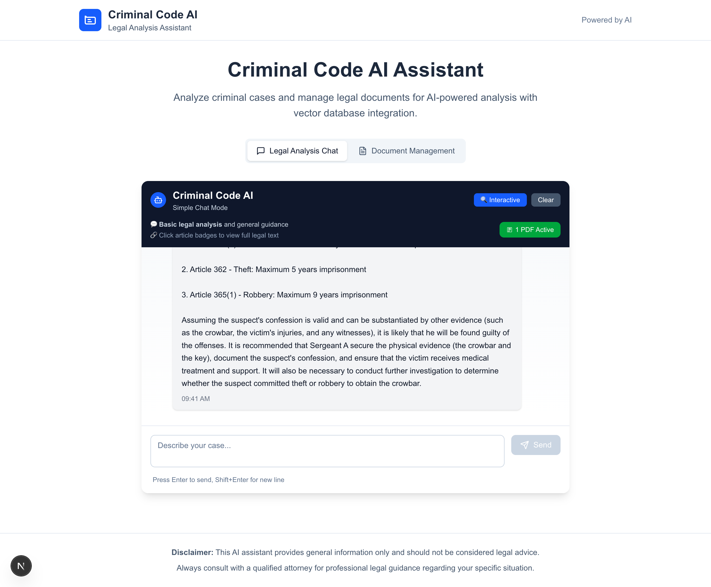
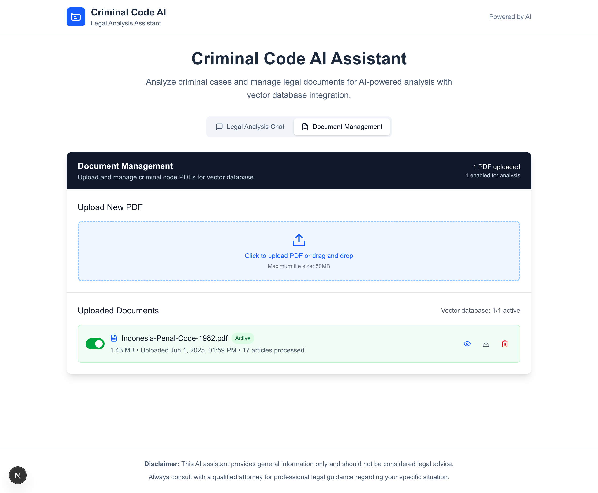

# Criminal Code AI - Indonesian Penal Code Legal Analysis

🤖 **Advanced AI-powered legal analysis system for Indonesian Criminal Code (KUHP)**

<!-- Deployment trigger: 2025-05-31 -->

## 🌟 Features

### 🧠 **Advanced AI Legal Analysis**
- **Interactive Legal Consultation** - Dynamic questioning system that adapts based on case complexity
- **Multi-Mode Analysis** - Simple chat, interactive analysis, 8-item analysis, and comprehensive flowchart modes  
- **Criminal Code Article Search** - Intelligent search through Indonesian Penal Code articles
- **Case Law Integration** - Analysis incorporating relevant Indonesian case law
- **Penalty Assessment** - Automated calculation of potential sentences and legal consequences

An intelligent Next.js application that provides comprehensive criminal law analysis using AI and vector databases. Features interactive legal consultation, PDF document processing, and advanced case analysis frameworks.

## 📸 Screenshots

### Interactive Analysis Mode

*Progressive questioning system for systematic legal analysis*

### Simple Chat Mode

*Basic legal consultation with AI-powered responses*

### Document Management

*PDF upload, processing, and management interface*

---

## 🚀 Quick Start

### Prerequisites
- **Node.js** 18.0 or higher
- **OpenAI API Key** (for GPT-4 analysis)
- **Qdrant Vector Database** (Docker recommended)

### 1. Clone the Repository
```bash
git clone https://github.com/yourusername/criminalcode-ai-nextjs.git
cd criminalcode-ai-nextjs
```

### 2. Install Dependencies
```bash
npm install
```

### 3. Set Up Environment Variables
Create a `.env.local` file in the root directory:
```env
# OpenAI Configuration
OPENAI_API_KEY=your_openai_api_key_here

# Qdrant Vector Database Configuration (criminal-code-ai-v2)
QDRANT_HOST=localhost
QDRANT_PORT=6333
# Remove QDRANT_URL and QDRANT_API_KEY for local setup

# Vercel Blob Storage Configuration (for production)
BLOB_READ_WRITE_TOKEN=your_vercel_blob_token_here

# Next.js Configuration
NEXTAUTH_SECRET=your_nextauth_secret_here
NEXTAUTH_URL=http://localhost:3000
```

### 4. Vector Database Setup
**Qdrant Cloud (Current Setup)**
✅ **Already configured!** This project uses Qdrant Cloud for production
- Collections are automatically created on first use
- No local setup required
- Configure your credentials in `.env.local`

**Local Development Alternative (Optional)**
```bash
# If you prefer local development
docker run -p 6333:6333 qdrant/qdrant
```

### 5. Run the Development Server
```bash
npm run dev
```

### 6. Open Your Browser
Navigate to [http://localhost:3000](http://localhost:3000)

You should see the Criminal Code AI interface ready for use! 🎉

---

## 🏛️ Features Overview

### 🔍 Dual Analysis Modes

#### **Interactive Analysis Mode**
Progressive questioning system that guides users through systematic legal analysis:
- **Stage 1**: Initial assessment and potential criminal categories
- **Stage 2**: Targeted fact gathering with critical questions
- **Stage 3**: Narrowing down to specific articles with penalty assessment  
- **Stage 4**: Final determination with complete legal recommendations

#### **Simple Chat Mode**
- Basic AI-powered legal consultation
- Immediate responses for quick guidance
- Enhanced with vector database context
- General legal education and information

### 📄 Document Processing
- **PDF Upload**: Process criminal code documents
- **Auto-Extraction**: Automatically parse articles and chapters
- **Text Search**: Find specific articles with PDF.js integration
- **Vector Storage**: Store content for semantic search

### 🗄️ Vector Database Integration
- **Crime Name Master**: Searchable criminal offense database
- **Criminal Code Articles**: Full-text legal provisions
- **Case Law Master**: Legal precedents and court decisions
- **Semantic Search**: Find relevant content by meaning, not just keywords

### 🔧 Advanced Analysis Tools
- **8-Item Model**: Structured criminal case framework
- **Constituent Element Flowcharts**: Interactive decision trees
- **Multi-Database Search**: Cross-reference multiple legal sources
- **Real-time Analysis**: Instant legal insights with AI

---

## 🛠️ Technology Stack

| Component | Technology | Purpose |
|-----------|------------|---------|
| **Frontend** | Next.js 15, React 18, Tailwind CSS | Modern, responsive UI |
| **Backend** | Node.js, API Routes | Server-side processing |
| **AI/ML** | OpenAI GPT-4, text-embedding-ada-002 | Legal analysis and embeddings |
| **Vector DB** | Qdrant (Rust-based) | High-performance semantic search |
| **PDF Processing** | PDF.js, pdf-lib | Document parsing and viewing |
| **Styling** | Tailwind CSS, Lucide Icons | Beautiful, consistent design |

---

## 📁 Project Structure

```
criminalcode-ai-nextjs/
├── src/
│   ├── app/                     # Next.js App Router
│   │   ├── api/
│   │   │   ├── chat/           # Simple chat API
│   │   │   │   ├── analyze/    # Interactive analysis API
│   │   │   │   ├── article-content/ # Article content fetching
│   │   │   │   └── pdfs/       # PDF management API
│   │   │   └── upload/         # PDF upload processing
│   │   ├── layout.js           # App layout and metadata
│   │   └── page.js             # Main application page
│   ├── components/
│   │   ├── ChatInterface.js    # Main chat interface
│   │   ├── PDFManager.js       # Document management
│   │   └── TabNavigation.js    # Navigation component
│   └── lib/
│       ├── legal/
│       │   ├── legalAnalyzer.js     # Core analysis logic
│       │   ├── documentProcessor.js # PDF processing
│       │   ├── eightItemModel.js    # 8-Item framework
│       │   └── constituentFlowchart.js # Decision trees
│       └── vector/
│           └── qdrant.js       # Vector database operations
├── public/
│   ├── pdfjs/                  # PDF.js viewer files
│   └── uploads/                # Uploaded PDF storage
├── docs/
│   └── images/                 # Screenshots and documentation images
└── package.json                # Dependencies and scripts
```

---

## 🔍 API Reference

### Legal Analysis API
**Endpoint**: `POST /api/legal/analyze`

#### Interactive Mode
```javascript
const response = await fetch('/api/legal/analyze', {
  method: 'POST',
  headers: { 'Content-Type': 'application/json' },
  body: JSON.stringify({
    mode: 'interactive',
    data: {
      description: 'A person was found with a stolen motorcycle...'
    },
    conversationHistory: [
      'Previous user input',
      'Previous AI response'
    ]
  })
});
```

#### Simple Chat
```javascript
const response = await fetch('/api/chat', {
  method: 'POST',
  headers: { 'Content-Type': 'application/json' },
  body: JSON.stringify({
    message: 'What constitutes theft under criminal law?',
    useAdvancedAnalysis: true
  })
});
```

### PDF Management API
**Upload**: `POST /api/upload`
**List**: `GET /api/legal/pdfs`
**Delete**: `DELETE /api/legal/pdfs`

### Article Content API
**Fetch Article**: `POST /api/legal/article-content`
```javascript
{
  "articleNumber": "362",
  "enabledPDFs": ["filename.pdf"]
}
```

---

## 📖 Usage Guide

### 1. First Time Setup
1. Start the application following the Quick Start guide
2. Upload your criminal code PDF documents via the Document Management tab
3. Enable the PDFs you want to use for analysis
4. Switch to the Legal Analysis tab to begin consultations

### 2. Using Interactive Analysis Mode
- Choose "Interactive Analysis Mode" for systematic legal consultation
- Describe your case in detail
- Answer the AI's targeted questions one by one
- Receive progressive analysis until final determination

### 3. Using Simple Chat Mode  
- Choose "Simple Chat Mode" for quick consultations
- Ask general legal questions or describe cases
- Get immediate AI-powered responses
- Click article badges to view full legal texts

### 4. Document Management
- Upload PDF files (max 50MB each)
- Enable/disable documents for analysis
- Delete unnecessary files
- View upload status and file information

### 5. Article Viewing
- Click any article badge (e.g., "Article 362") in AI responses
- View detailed legal provisions and penalties
- Use "Open & Search PDF" to jump to exact article location
- Access original PDF with highlighted search terms

---

## 🔧 Configuration

### Environment Variables
```env
# Required
OPENAI_API_KEY=sk-your-openai-api-key

# Qdrant Database (adjust as needed)
QDRANT_HOST=localhost
QDRANT_PORT=6333

# Optional: For Qdrant Cloud
# QDRANT_API_KEY=your-cloud-api-key
# QDRANT_URL=your-cloud-instance-url

# Optional: Upload limits
MAX_FILE_SIZE=52428800  # 50MB default
```

### Qdrant Setup Options

#### Local Docker Setup
```bash
# Basic setup
docker run -p 6333:6333 qdrant/qdrant

# With persistent storage
docker run -p 6333:6333 -v $(pwd)/qdrant_storage:/qdrant/storage qdrant/qdrant
```

#### Docker Compose Setup
```yaml
version: '3.8'
services:
  qdrant:
    image: qdrant/qdrant
    ports:
      - "6333:6333"
    volumes:
      - qdrant_data:/qdrant/storage
volumes:
  qdrant_data:
```

#### Cloud Setup
For production, consider using [Qdrant Cloud](https://cloud.qdrant.io/) for managed hosting.

---

## 🔐 Legal Disclaimers

⚖️ **Important Notice**: This system is designed for:
- Legal education and research purposes
- Academic analysis and study
- Professional legal assistance (not replacement)
- Case preparation and preliminary analysis

**This system does NOT provide legal advice. Always consult qualified legal counsel for actual legal matters.**

---

## 🚦 Troubleshooting

### Common Issues

#### "Failed to connect to Qdrant"
- Ensure Qdrant is running on port 6333
- Check firewall settings
- Verify QDRANT_HOST and QDRANT_PORT in .env.local

#### "OpenAI API Error"
- Verify your OPENAI_API_KEY is valid
- Check your OpenAI account has credits
- Ensure API key has GPT-4 access

#### "PDF Upload Failed"
- Check file size (max 50MB)
- Ensure PDF is not password protected
- Verify upload directory permissions

#### "Article not found in PDF"
- Try uploading the correct criminal code document
- Check if PDF contains the article number
- Enable more PDF documents in Document Management

### Development Issues

#### Port 3000 already in use
```bash
npx kill-port 3000
# or
lsof -ti:3000 | xargs kill
```

#### Clear Qdrant database
```bash
curl -X DELETE http://localhost:6333/collections/criminal_code_articles
curl -X DELETE http://localhost:6333/collections/crime_name_master
```

---

## 🤝 Contributing

We welcome contributions! Please follow these steps:

1. **Fork the repository**
2. **Create a feature branch**
   ```bash
   git checkout -b feature/amazing-feature
   ```
3. **Make your changes**
4. **Commit your changes**
   ```bash
   git commit -m 'Add amazing feature'
   ```
5. **Push to the branch**
   ```bash
   git push origin feature/amazing-feature
   ```
6. **Open a Pull Request**

### Development Guidelines
- Follow existing code style
- Add tests for new features
- Update documentation as needed
- Ensure all tests pass before submitting

---

## 📄 License

This project is licensed under the MIT License - see the [LICENSE](LICENSE) file for details.

---

## 🌟 Future Enhancements

- [ ] Multi-language support (Japanese criminal code)
- [ ] Advanced UI for 8-Item Model and Flowcharts
- [ ] Case law precedent integration
- [ ] Document comparison and analysis
- [ ] Export to legal document formats
- [ ] Mobile app development
- [ ] Integration with legal practice management systems
- [ ] Batch document processing capabilities

---

## 📞 Support

- **Documentation**: Check this README and inline code comments
- **Issues**: Use GitHub Issues for bug reports and feature requests
- **Questions**: Start a GitHub Discussion for usage questions

---

**Built with ⚖️ for legal professionals, researchers, and students**

*Criminal Code AI - Making legal analysis accessible through artificial intelligence*
